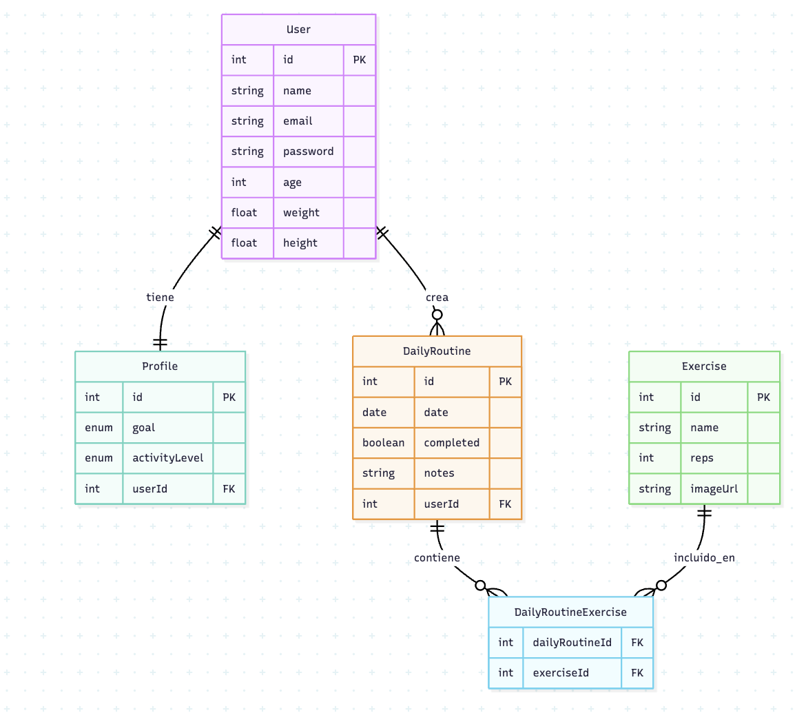

# 🏋️‍♂️ Fitness App Backend

## 📖 Descripción del Proyecto

Este es el backend de una aplicación web completa que funciona como un **asistente personal de fitness**. La aplicación permite a los usuarios llevar un control detallado de sus entrenamientos y seguimiento de progreso físico.

### 🎯 Objetivo Principal

Centralizar toda la información de entrenamiento de un usuario en una sola plataforma, permitiéndole:
- Establecer objetivos personales de fitness (perder peso, ganar músculo, mantener forma)
- Crear y seguir rutinas de ejercicio personalizadas
- Registrar su progreso en cada ejercicio (peso, repeticiones, series)
- Visualizar su historial de entrenamientos y datos físicos

---

## 🛠️ Stack Tecnológico

- **Framework**: NestJS
- **ORM**: TypeORM
- **Base de datos**: SQLite (escalable a PostgreSQL/MySQL)
- **Lenguaje**: TypeScript

---

## 📊 Modelo de Datos y Entidades

El sistema está compuesto por **4 entidades principales** que manejan toda la funcionalidad de gestión de rutinas de ejercicio:



> **💡 Tip**: Las relaciones están diseñadas para mantener la integridad de los datos y facilitar consultas eficientes.

### 1️⃣ User (Usuario)

**Descripción**: Representa a cada usuario registrado en la aplicación.

**Campos**:
- `id` (UUID o number): Identificador único del usuario
- `name` (string): Nombre completo del usuario
- `email` (string): Correo electrónico (único)
- `password` (string): Contraseña encriptada
- `age` (number): Edad del usuario
- `weight` (number): Peso actual en kilogramos
- `height` (number): Altura en centímetros

**Relaciones**:
- `1:1` con **Profile** → Un usuario tiene un único perfil
- `1:N` con **WeeklyRoutine** → Un usuario puede tener múltiples rutinas diarias

**Ejemplo de datos**:
```json
{
  "id": 1,
  "name": "Juan Pérez",
  "email": "juan.perez@email.com",
  "age": 28,
  "weight": 75.5,
  "height": 175
}
```

---

### 2️⃣ Profile (Perfil del Usuario)

**Descripción**: Almacena información específica sobre los objetivos y nivel de actividad del usuario.

**Campos**:
- `id` (UUID o number): Identificador único del perfil
- `goal` (enum: 'LOSE_WEIGHT' | 'GAIN_MUSCLE' | 'MAINTAIN'): Objetivo del usuario
- `activityLevel` (enum: 'SEDENTARY' | 'LIGHT' | 'MODERATE' | 'ACTIVE' | 'VERY_ACTIVE'): Nivel de actividad física
- `userId` (number): Clave foránea hacia User

**Relaciones**:
- `1:1` con **User** → Un perfil pertenece a un único usuario

**Ejemplo de datos**:
```json
{
  "id": 1,
  "goal": "GAIN_MUSCLE",
  "activityLevel": "MODERATE",
  "userId": 1
}
```

---

### 3️⃣ WeeklyRoutine (Rutina Semanal de Ejercicios)

**Descripción**: Representa una rutina de ejercicios planificada para un día específico de la semana.

**Campos**:
- `id` (UUID o number): Identificador único de la rutina
- `dayOfWeek` (enum: 'MONDAY' | 'TUESDAY' | 'WEDNESDAY' | 'THURSDAY' | 'FRIDAY' | 'SATURDAY' | 'SUNDAY'): Día de la semana
- `completed` (boolean): Indica si la rutina fue completada esta semana
- `notes` (string, opcional): Notas adicionales del usuario
- `userId` (number): Clave foránea hacia User

**Relaciones**:
- `N:1` con **User** → Muchas rutinas pertenecen a un usuario
- `N:M` con **Exercise** → Una rutina puede contener múltiples ejercicios, y un ejercicio puede estar en múltiples rutinas

**Ejemplo de datos**:
```json
{
  "id": 1,
  "dayOfWeek": "MONDAY",
  "completed": false,
  "notes": "Rutina de pierna",
  "userId": 1
}
```

---

### 4️⃣ Exercise (Ejercicio)

**Descripción**: Catálogo de ejercicios disponibles en la aplicación.

**Campos**:
- `id` (UUID o number): Identificador único del ejercicio
- `name` (string): Nombre del ejercicio (ej: "Sentadilla")
- `reps` (string): Descripción detallada de cómo realizar el ejercicio
- `videoUrl` (string, opcional): URL de un video demostrativo

**Relaciones**:
- `N:M` con **WeeklyRoutine** → Un ejercicio puede estar en múltiples rutinas

**Relación N:M**: TypeORM maneja automáticamente la tabla intermedia `weekly_routine_exercises` con solo `weeklyRoutineId` y `exerciseId`.

**Ejemplo de datos**:
```json
{
  "id": 1,
  "name": "Sentadilla con Barra",
  "reps": 5,
  "imageUrl": "https://example.com/videos/squat.png"
}
```

### 📋 Resumen de Relaciones

- **User ↔ Profile**: Relación 1:1 (un usuario tiene un perfil único)
- **User → WeeklyRoutine**: Relación 1:N (un usuario puede tener múltiples rutinas semanales)
- **WeeklyRoutine ↔ Exercise**: Relación N:M a través de `WeeklyRoutineExercise` (una rutina puede tener múltiples ejercicios, un ejercicio puede estar en múltiples rutinas)

---

## 🚀 Guía de Implementación

### 📋 **Paso 1: Crear el Proyecto** ✅ **COMPLETADO**

#### **1.1 Crear estructura de carpetas** ✅
```bash
mkdir fitness-app
cd fitness-app
mkdir backend
```

#### **1.2 Inicializar Backend (NestJS)** ✅
```bash
cd backend
npm i -g @nestjs/cli
nest new . --package-manager npm
npm install @nestjs/typeorm typeorm sqlite3 class-validator class-transformer @nestjs/config
```

#### **1.3 Configurar Validaciones Globales** ✅
```typescript
// main.ts - Configuración de ValidationPipe
app.useGlobalPipes(
  new ValidationPipe({
    whitelist: true, // Eliminar propiedades no definidas en el DTO
    forbidNonWhitelisted: true, // Lanzar error si se envían propiedades extra
    transform: true, // Transformar automáticamente tipos (string → number)
  }),
);
```

#### **1.4 Limpiar Testing** ✅
- Eliminados todos los archivos de test
- Removidas dependencias de testing del `package.json`
- Limpiados scripts de testing
- Eliminada configuración de Jest

#### **1.7 Configurar Variables de Entorno** ✅
```bash
# Crear archivo .env desde la plantilla
cp .env.example .env

# El archivo .env debe contener:
DB_TYPE=sqlite
DB_DATABASE=./fitness.db
DB_SYNCHRONIZE=true
DB_LOGGING=true
PORT=3001
```

> **📌 Importante**: El archivo `.env` es el que lee la aplicación en tiempo de ejecución. El `.env.example` es solo una plantilla para otros desarrolladores.

#### **📁 Estructura Final del Proyecto:**
```
fitness-app-backend/
├── .env                    # Variables de entorno (local)
├── .env.example           # Plantilla de variables de entorno
├── .gitignore            # Archivos ignorados por Git
├── package.json          # Dependencias y scripts (sin testing)
├── src/
│   ├── app.module.ts     # Módulo principal con ConfigModule
│   ├── app.controller.ts # Controlador básico
│   ├── app.service.ts    # Servicio básico
│   ├── main.ts          # Punto de entrada con ValidationPipe
│   └── database/
│       └── database.module.ts # Configuración escalable de BD
└── fitness.db           # Base de datos SQLite
```

### 📋 **Paso 2: Configurar Entidades**

#### **2.1 Crear entidades TypeORM**
- `User` entity
- `Profile` entity  
- `WeeklyRoutine` entity
- `Exercise` entity

#### **2.2 Configurar relaciones**
- User ↔ Profile (1:1)
- User → WeeklyRoutine (1:N)
- WeeklyRoutine ↔ Exercise (N:M)

### 📋 **Paso 3: Implementar Módulos**

#### **3.1 Crear módulos NestJS**
- Users Module
- Profiles Module
- Routines Module
- Exercises Module

#### **3.2 Implementar servicios**
- CRUD básico para cada entidad
- Lógica de negocio

#### **3.3 Implementar controladores**
- Endpoints REST
- Validaciones con DTOs

---

## 📝 Requerimientos Funcionales del Backend (NestJS)

### 1. Estructura de Módulos

El proyecto debe estar organizado en módulos siguiendo la arquitectura de NestJS:

```
src/
├── users/
│   ├── entities/
│   │   └── user.entity.ts
│   ├── dto/
│   │   ├── create-user.dto.ts
│   │   └── update-user.dto.ts
│   ├── controllers/
│   │   └── users.controller.ts
│   ├── services/
│   │   └── users.service.ts
│   └── users.module.ts
├── profiles/
│   ├── entities/
│   │   └── profile.entity.ts
│   ├── dto/
│   │   ├── create-profile.dto.ts
│   │   └── update-profile.dto.ts
│   ├── controllers/
│   │   └── profiles.controller.ts
│   ├── services/
│   │   └── profiles.service.ts
│   └── profiles.module.ts
├── routines/
│   ├── entities/
│   │   └── weekly-routine.entity.ts
│   ├── dto/
│   │   ├── create-routine.dto.ts
│   │   └── update-routine.dto.ts
│   ├── controllers/
│   │   └── routines.controller.ts
│   ├── services/
│   │   └── routines.service.ts
│   └── routines.module.ts
├── exercises/
│   ├── entities/
│   │   └── exercise.entity.ts
│   ├── dto/
│   │   ├── create-exercise.dto.ts
│   │   └── update-exercise.dto.ts
│   ├── controllers/
│   │   └── exercises.controller.ts
│   ├── services/
│   │   └── exercises.service.ts
│   └── exercises.module.ts
├── database/
│   └── database.module.ts
└── app.module.ts
```

### 2. Endpoints Obligatorios

> **📌 Principio de Responsabilidad**: Cada módulo es completamente responsable de sus propias entidades. Los endpoints están organizados para que cada módulo maneje únicamente sus datos.

#### **Users**
- `POST /users` - Crear usuario (se crea automáticamente el perfil con valores por defecto)
- `GET /users` - Obtener lista de usuarios
- `GET /users/:id` - Obtener usuario por id (incluye perfil)
- `PUT /users/:id` - Actualizar información del usuario
- `DELETE /users/:id` - Eliminar usuario o desactivarlo
- `GET /users/:id/routines` - Obtener todas las rutinas del usuario

#### **Profiles**
- `GET /profiles/:userId` - Obtener perfil de un usuario
- `PUT /profiles/:userId` - Actualizar perfil (objetivo, nivel de actividad)

#### **Routines**
- `POST /routines` - Crear rutina semanal
- `GET /routines/:id` - Obtener rutina por id (con ejercicios incluidos)
- `GET /routines` - Listar rutinas (con filtros: dayOfWeek, completed, userId)
- `PUT /routines/:id` - Actualizar rutina (día de la semana, notas, estado)
- `DELETE /routines/:id` - Eliminar rutina
- `PATCH /routines/:id/complete` - Marcar rutina como completada esta semana
- `POST /routines/:routineId/exercises` - Agregar ejercicio a rutina
- `DELETE /routines/:routineId/exercises/:exerciseId` - Eliminar ejercicio de rutina

#### **Exercises**
- `POST /exercises` - Crear ejercicio
- `GET /exercises` - Listar ejercicios disponibles
- `GET /exercises/:id` - Obtener ejercicio
- `PUT /exercises/:id` - Actualizar ejercicio
- `DELETE /exercises/:id` - Eliminar ejercicio

---

## 🚀 Comandos de Desarrollo

### Setup Inicial
```bash
# 1. Instalar dependencias
npm install

# 2. Crear archivo de variables de entorno
cp .env.example .env

# 3. Verificar que el archivo .env contiene las variables correctas
cat .env
```

### Instalación
```bash
npm install
```

### Desarrollo
```bash
npm run start:dev
```

### Compilación
```bash
npm run build
```

### Linting
```bash
npm run lint
```

### Formateo
```bash
npm run format
```

---

## 🔧 Configuración de Base de Datos

### Variables de Entorno

El proyecto está configurado para ser escalable entre diferentes tipos de base de datos:

#### **Crear archivo .env**
```bash
# Copiar la plantilla
cp .env.example .env

# Editar con tus valores específicos
nano .env  # o usar tu editor preferido
```

#### **Contenido del archivo .env**
```bash
# .env
DB_TYPE=sqlite                    # Tipo de BD (sqlite, postgres, mysql, mariadb)
DB_DATABASE=./fitness.db         # Archivo de BD para SQLite
DB_SYNCHRONIZE=true              # Crear tablas automáticamente (solo desarrollo)
DB_LOGGING=true                  # Ver consultas SQL en consola
PORT=3001                        # Puerto de la aplicación
```

> **📌 Importante**: 
> - El archivo `.env` es el que lee la aplicación en tiempo de ejecución
> - El archivo `.env.example` es solo una plantilla para otros desarrolladores
> - Nunca commitees el archivo `.env` al repositorio (está en `.gitignore`)

### Migración a PostgreSQL/MySQL

Para migrar a una base de datos de producción, simplemente cambia las variables de entorno:

```bash
# Para PostgreSQL
DB_TYPE=postgres
DB_HOST=localhost
DB_PORT=5432
DB_USERNAME=fitness_user
DB_PASSWORD=fitness_password
DB_DATABASE=fitness_db
```

---

## 📊 Estado del Proyecto

- ✅ **Paso 1: COMPLETADO** (Configuración inicial del proyecto)
- 📋 **Paso 2: Pendiente** (Configurar Entidades)
- 📋 **Paso 3: Pendiente** (Implementar Módulos)

---

¡Mucho éxito! 💪🏋️‍♂️
